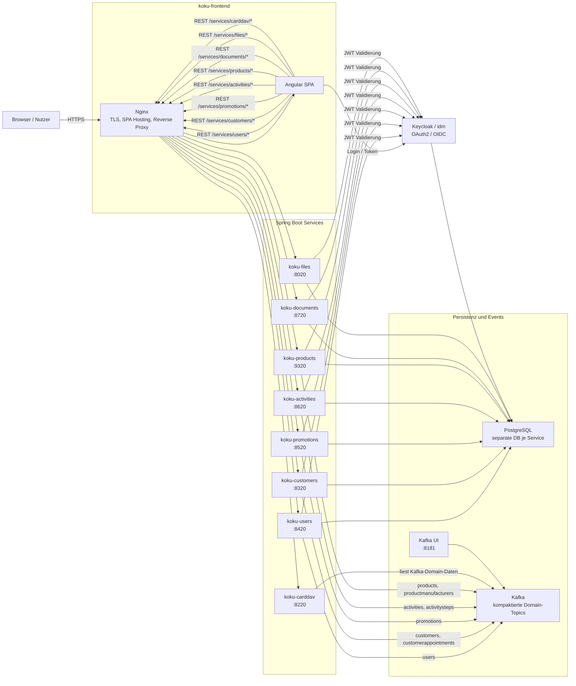
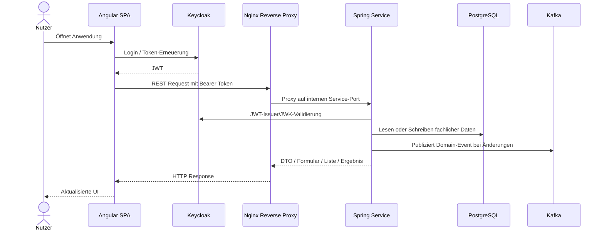

# Koku Architektur

Dieses Dokument beschreibt die grobe Architektur von Koku: welche Bausteine es gibt, wie sie miteinander kommunizieren und welche Rolle die gemeinsamen Module im Maven-Monorepo spielen.

## Überblick

Koku ist als modulare Webanwendung aufgebaut. Das Frontend ist eine Angular-SPA, die per Nginx ausgeliefert wird. Nginx dient gleichzeitig als Reverse Proxy für die Backend-Services. Die fachlichen Backend-Domänen laufen als getrennte Spring-Boot-Services, besitzen jeweils eigene PostgreSQL-Datenbanken und veröffentlichen Änderungen über Kafka-Topics. Keycloak stellt Authentifizierung und JWT-Ausstellung bereit.



## Laufzeit-Kommunikation

### Frontend zu Backend

Das Frontend wird aus `koku-frontend` gebaut und in einem Nginx-Container ausgeliefert. Die Angular-App spricht nicht direkt mit den internen Service-Hosts, sondern nutzt Pfade unter `/services/...`. Nginx schreibt diese Pfade um und routet auf die Docker-internen Services:

| Frontend-Pfad | Backend-Service | Port |
| --- | --- | --- |
| `/services/users/*` | `koku-users` | `8420` |
| `/services/customers/*` | `koku-customers` | `8320` |
| `/services/promotions/*` | `koku-promotions` | `8520` |
| `/services/activities/*` | `koku-activities` | `8620` |
| `/services/products/*` | `koku-products` | `9320` |
| `/services/documents/*` | `koku-documents` | `8720` |
| `/services/files/*` | `koku-files` | `8020` |
| `/services/carddav/*` | `koku-carddav` | `8220` |

Die UI ist stark DTO-getrieben: Backends liefern Formular-, Listen-, Kalender- und Dashboard-Strukturen aus gemeinsamen DTO-Modulen. Das Angular-Frontend rendert diese Strukturen über Registries und Renderer-Komponenten.

### Authentifizierung

Keycloak läuft als Service `idm` und nutzt die PostgreSQL-Datenbank `keycloak`. Das Frontend erhält seine OIDC-Konfiguration zur Laufzeit über `authconfig.json`, das aus Umgebungsvariablen erzeugt wird. Die Spring-Services sind als OAuth2 Resource Server konfiguriert und validieren JWTs gegen den Keycloak-Issuer.

### Datenhaltung

PostgreSQL läuft als gemeinsamer Datenbankserver, aber die Services verwenden getrennte Datenbanken:

| Service | Datenbank |
| --- | --- |
| `koku-users` | `users` |
| `koku-customers` | `customers` |
| `koku-promotions` | `promotions` |
| `koku-activities` | `activities` |
| `koku-products` | `products` |
| `koku-documents` | `documents` |
| `koku-files` | `files` |
| `idm` | `keycloak` |

Jeder Spring-Service verwendet Flyway und das Schema `koku`. Damit bleiben Schema-Migrationen service-nah und unabhängig deploybar.

### Event-Kommunikation

Kafka dient als asynchroner Kommunikationskanal und als Quelle für replizierte Domain-Sichten. Die Compose-Initialisierung legt kompaktierte Topics an:

| Topic | Produzent |
| --- | --- |
| `users` | `koku-users` |
| `customers` | `koku-customers` |
| `customerappointments` | `koku-customers` |
| `promotions` | `koku-promotions` |
| `products` | `koku-products` |
| `productmanufacturers` | `koku-products` |
| `activities` | `koku-activities` |
| `activitysteps` | `koku-activities` |

Die Producer liegen in den jeweiligen Service-Modulen als `KafkaTemplate`-basierte Services. `koku-carddav` besitzt keine eigene Datenbank und ist als Integrationsservice angebunden; er nutzt Kafka-Konfiguration und CardDAV-Zugangsdaten, um Adressbuch-/Principal-Endpunkte bereitzustellen.

## Backend-Module

Die fachlichen Services sind in Domänenmodule gegliedert:

| Modul | Aufgabe |
| --- | --- |
| `koku-user` | Nutzer, Regionen, Willkommensdaten und private Termine |
| `koku-customer` | Kunden und Kundentermine |
| `koku-product` | Produkte und Hersteller |
| `koku-promotion` | Aktionen / Promotions |
| `koku-activity` | Behandlungen, Aktivitäten und Aktivitätsschritte |
| `koku-document` | Dokument- und Dokumentvorlagen-Funktionen |
| `koku-file` | Datei-Upload, Dateiabruf und Dateiverwaltung |
| `koku-carddav` | CardDAV-kompatible Schnittstellen |
| `koku-auth` | Authentifizierungsnahe gemeinsame Konfiguration / Hilfen |

Mehrere Domänenmodule enthalten zusätzlich ein `*-kafka-dto`-Submodul. Diese Kafka-DTOs beschreiben die Event-Payloads, die über Kafka zwischen Services geteilt werden.

## Gemeinsame Bibliotheken

Neben den ausführbaren Services gibt es wiederverwendbare Bibliotheksmodule:

| Modul | Aufgabe |
| --- | --- |
| `koku-dto` | Gemeinsame Koku-DTOs für Formulare, Listen, Events, Container und UI-Modelle |
| `formular` | Generische Formular-DTOs und Formular-Factory-Bausteine |
| `list` | Generische Listen-DTOs und Listen-Factory-Bausteine |
| `list-query` | Query-/Filter-Unterstützung für Listen |
| `calendar` | Kalender-DTOs und Kalender-UI-Modelle |
| `chart` | Chart-DTOs |
| `dashboard` | Dashboard-DTOs |
| `business-logic` | Business-Rule-DTOs und Ausführungsmodelle |
| `business-exception` | Fachliche Exception-DTOs und Bestätigungsdialoge |
| `migrate` | Migrations-/Runner-Artefakte |

Diese Module stabilisieren die Verträge zwischen Backend und Frontend. Besonders wichtig ist dabei, dass die Java-DTOs in TypeScript-Typen für das Frontend übersetzt werden.

## Typischer Request-Flow



## Deklarative UI-Konzepte

Koku folgt bei den wichtigsten UI-Typen einem deklarativen Ansatz: Das Backend beschreibt nicht HTML oder Angular-Komponenten direkt, sondern liefert DTOs aus. Diese DTOs definieren Felder, Container, Aktionen, Datenquellen, Filter, Events und Darstellungshinweise. Das Frontend besitzt pro UI-Typ eine Registry, die anhand von `@type` entscheidet, welche Angular-Komponente gerendert wird.

Dadurch liegt fachliche UI-Struktur nah an der jeweiligen Domäne im Backend, während Rendering, Styling und Interaktion zentral im Frontend implementiert bleiben.

### Formulare

Formulare werden im Backend mit `FormViewFactory` und Formular-DTOs aufgebaut. Ein Service beschreibt, welche Felder angezeigt werden, welche Werte aus dem Source-Objekt gebunden werden, welche Buttons existieren und welche Events nach Aktionen passieren.

Beispiel aus dem Stil der bestehenden Controller:

```java
final FormViewFactory formFactory = new FormViewFactory(
        new DefaultViewContentIdGenerator(),
        GridContainer.builder().cols(1).build());

formFactory.addField(InputFormularField.builder()
        .label("Name")
        .valuePath(KokuProductDto.Fields.name)
        .build());

formFactory.addField(InputFormularField.builder()
        .label("Preis")
        .type(EnumInputFormularFieldType.NUMBER)
        .valuePath(KokuProductDto.Fields.price)
        .build());

formFactory.addButton(KokuFormButton.builder()
        .buttonType(EnumButtonType.SUBMIT)
        .text("Speichern")
        .icon("SAVE")
        .build());

return formFactory.create();
```

Im Frontend rendert `FORMULAR_CONTENT_SETUP` die DTOs über Feld-, Container-, Layout- und Button-Registries. Ein `InputFormularField` wird dadurch zu einer passenden Input-Komponente, ein `GridContainer` zu Layout, ein `KokuFormButton` zu einer Button-Komponente mit Submit-Verhalten, Confirmation, Toasts und globalen Events.

Der gleiche Mechanismus erlaubt verschachtelte Container, bedingte Sichtbarkeit, Feld-Events, Business Rules und dynamisch geladene Inline-Formulare.

### Listen

Listen werden im Backend mit `ListViewFactory` beschrieben. Die Deklaration legt fest, welche Felder aus einem Listenelement angezeigt werden, welche Filter und Actions verfügbar sind, ob Details oder Inline-Inhalte geöffnet werden können und wie Items abhängig von Werten gestylt werden.

Beispiel:

```java
final ListViewFactory listViewFactory =
        new ListViewFactory(new DefaultListViewContentIdGenerator(), KokuUserAppointmentDto.Fields.id);

final ListViewFieldReference startDateRef = listViewFactory.addField(
        ListViewInputFieldDto.builder()
                .valuePath(KokuUserAppointmentDto.Fields.startDate)
                .type(ListViewInputFieldTypeEnumDto.DATE)
                .build());

final ListViewFieldReference descriptionRef = listViewFactory.addField(
        ListViewInputFieldDto.builder()
                .valuePath(KokuUserAppointmentDto.Fields.description)
                .build());

listViewFactory.addItemStyling(ListViewConditionalItemValueStylingDto.builder()
        .compareValuePath(KokuUserAppointmentDto.Fields.deleted)
        .expectedValue(Boolean.TRUE)
        .positiveStyling(ListViewItemStylingDto.builder()
                .lineThrough(true)
                .opacity((short) 50)
                .build())
        .build());

return listViewFactory.create();
```

Im Frontend übernimmt `LIST_CONTENT_SETUP` das Rendering. Felder werden über Field-Renderer angezeigt, Actions über Action-Komponenten ausgeführt und Inline-Content kann wiederum Formulare, Listen, Kalender oder Charts enthalten. Damit können Listen nicht nur Tabellen oder Karten sein, sondern Einstiegspunkte in komplexere Workflows.

Typische deklarative Listenbestandteile sind:

- Felder mit `valuePath` auf das Item-DTO
- Filter und Suchfelder
- Item-Actions wie Öffnen, HTTP-Aufruf oder globales Event
- Conditional Styling für gelöschte, inaktive oder auffällige Einträge
- Routed oder Inline Content für Details

### Kalender

Kalenderansichten folgen ebenfalls dem DTO-Prinzip. Das Backend oder die Route beschreibt Quellen, Header, Inline-Content, Klickaktionen und Item-Darstellung. Die eigentlichen Kalenderfunktionen werden im Frontend über `CALENDAR_CONTENT_SETUP` und Calendar-Plugins umgesetzt.

Beispielhaft kann eine Kalender-Panel-Deklaration auf mehrere Listenquellen verweisen:

```java
final List<DashboardAppointmentsPanelListSourceDto> sources = List.of(
        DashboardAppointmentsPanelListSourceDto.builder()
                .title("Kundentermine")
                .listUrl("services/customers/customers/appointments")
                .startDateFieldSelectionPath("startDate")
                .startTimeFieldSelectionPath("startTime")
                .displayTextFieldSelectionPath("customerFullName")
                .build(),
        DashboardAppointmentsPanelListSourceDto.builder()
                .title("Private Termine")
                .listUrl("services/users/users/appointments")
                .startDateFieldSelectionPath("startDate")
                .startTimeFieldSelectionPath("startTime")
                .displayTextFieldSelectionPath("description")
                .build());

dashboardFactory.addPanel(DashboardAppointmentsPanelDto.builder()
        .headline("Termine")
        .listSources(sources)
        .build());
```

Das Frontend lädt die referenzierten Quellen, normalisiert die Items zu Kalenderereignissen und rendert sie mit FullCalendar. Klicks auf Kalenderitems können deklarativ weitere Inhalte öffnen, etwa ein Formular für den Termin oder eine geroutete Detailansicht.

Typische Kalender-Deklarationen beschreiben:

- Datenquellen für Termine
- Mapping von Datums-, Zeit-, Titel- und Löschfeldern
- Click-Actions für Items und Datumsbereiche
- Inline-Formulare oder Listen im Kalenderkontext
- globale Refresh-Events nach Änderungen

### Charts

Charts werden als Chart-DTOs geliefert, zum Beispiel `LineChartDto` oder `BarChartDto`. Das Backend berechnet die fachlichen Datenreihen und beschreibt Achsen, Serien, Kategorien und Filter. Das Frontend rendert diese Deklaration über `CHART_CONTENT_SETUP`, aktuell auf Basis der Chart-Binding-Komponenten.

Beispiel:

```java
return LineChartDto.builder()
        .title("Preisentwicklung")
        .series(List.of(LineChartSeriesDto.builder()
                .name("Preis")
                .data(priceHistory)
                .build()))
        .axes(AxesDto.builder()
                .x(CategoricalXAxisDto.builder()
                        .categories(monthLabels)
                        .build())
                .y(List.of(YAxisDto.builder()
                        .text("EUR")
                        .build()))
                .build())
        .build();
```

Charts können eigenständig über Routen angezeigt oder als Inline-Content in Listen und Dashboards eingebettet werden. Filter werden ebenfalls deklarativ beschrieben, zum Beispiel Monatsfilter für Umsatzstatistiken. Das Frontend muss dadurch nicht wissen, wie Umsatz, Preisverlauf oder Kundenstatistik berechnet werden; es kennt nur das Chart-Modell und rendert es konsistent.

Typische Chart-Deklarationen enthalten:

- Chart-Typ wie Linie oder Balken
- Serien und Datenpunkte
- Achsen, Kategorien und Labels
- Filterdefinitionen
- Einbettung in Listen-Details oder Dashboard-Panels

## Deployment-Bausteine

Das lokale beziehungsweise containerisierte Deployment wird über `docker-compose.yml` beschrieben:

- `koku-frontend` baut und hostet die Angular-App mit Nginx.
- `koku-db` stellt PostgreSQL bereit.
- `db-init` erzeugt die benötigten Datenbanken.
- `kafka` stellt den Broker im KRaft-Modus bereit.
- `init-kafka` erzeugt die Domain-Topics.
- `idm` startet Keycloak mit PostgreSQL-Backend.
- `kafka-ui` macht Kafka für Entwicklung und Betrieb sichtbar.
- Die Spring-Services werden als Images gestartet und bekommen Datenbank-, Kafka- und Keycloak-Konfiguration über Umgebungsvariablen.

TLS-Zertifikate und CA-Bindings werden über Volumes eingebunden. Die Spring-Services bekommen über `SERVICE_BINDING_ROOT=/bindings` Zugriff auf CA-Zertifikate.

## Architekturprinzipien

- Domänen sind als separate Services mit eigener Datenbank geschnitten.
- Synchrone UI-Kommunikation läuft über REST und Nginx-Reverse-Proxy.
- Asynchrone Domänenänderungen laufen über Kafka.
- Authentifizierung ist zentral über Keycloak gelöst, Autorisierung erfolgt in den Resource-Servern über JWTs.
- UI-Strukturen sind DTO-getrieben, damit Backends Formulare, Listen und Aktionen deklarativ beschreiben können.
- Gemeinsame Maven-Module definieren Verträge und UI-Bausteine, während ausführbare Services fachliche Persistenz und APIs kapseln.
