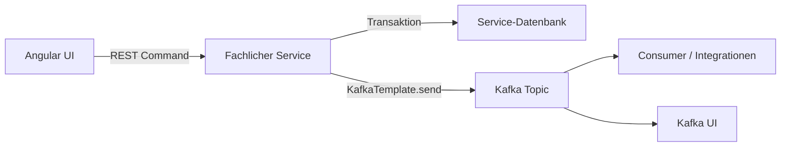

# Datenhaltung und Eventing

Koku trennt fachliche Datenbanken pro Service und nutzt Kafka für asynchrone Domain-Events.

## Datenbankmodell

PostgreSQL läuft als gemeinsamer Datenbankserver. Fachliche Services greifen jeweils auf eine eigene Datenbank zu. Innerhalb der Services wird Flyway genutzt, Standard-Schema ist `koku`.

| Service | Datenbank | Migration |
| --- | --- | --- |
| `koku-users` | `users` | Flyway |
| `koku-customers` | `customers` | Flyway |
| `koku-promotions` | `promotions` | Flyway |
| `koku-activities` | `activities` | Flyway |
| `koku-products` | `products` | Flyway |
| `koku-documents` | `documents` | Flyway |
| `koku-files` | `files` | Flyway |
| `idm` | `keycloak` | Keycloak-eigene Migrationen |

## Event-Topics

Kafka-Topics werden in `docker-compose.yml` über `init-kafka` angelegt. Die Topics sind kompaktierend konfiguriert und eignen sich damit für aktuelle Sichten pro Schlüssel.

| Topic | Produzent | Inhalt |
| --- | --- | --- |
| `users` | `koku-users` | Nutzerereignisse / User-Snapshots |
| `customers` | `koku-customers` | Kundenereignisse / Customer-Snapshots |
| `customerappointments` | `koku-customers` | Kundentermine |
| `promotions` | `koku-promotions` | Aktionen / Promotions |
| `products` | `koku-products` | Produkte |
| `productmanufacturers` | `koku-products` | Produkthersteller |
| `activities` | `koku-activities` | Aktivitäten |
| `activitysteps` | `koku-activities` | Aktivitätsschritte |

## Event-Fluss

## Konsistenzmodell

Die REST-Antwort liefert dem Benutzer direkt das Ergebnis einer synchronen Änderung. Kafka dient ergänzend zur Verteilung von Änderungen an andere Teile des Systems. Daraus ergibt sich ein typisches Enterprise-Muster:

- Schreibmodell ist service-lokal und transaktional.
- Lesemodelle oder Integrationen können asynchron aktualisiert werden.
- Eventual Consistency ist für Kafka-basierte Folgeprozesse einzuplanen.
- DTO- und Topic-Verträge müssen rückwärtskompatibel weiterentwickelt werden.

## Enterprise-Hinweise

- Für produktionskritische Events sollten Producer-Fehler, Retry-Verhalten und Dead-Letter-Strategien dokumentiert werden.
- Schema-Kompatibilität der Kafka-DTOs sollte versioniert und getestet werden.
- Datenbank-Migrationen sollten in CI gegen leere und bestehende Schemas geprüft werden.
- Fachliche Löschungen werden im Code teilweise über `deleted`-Flags modelliert; diese Semantik sollte in APIs und Events konsistent bleiben.

