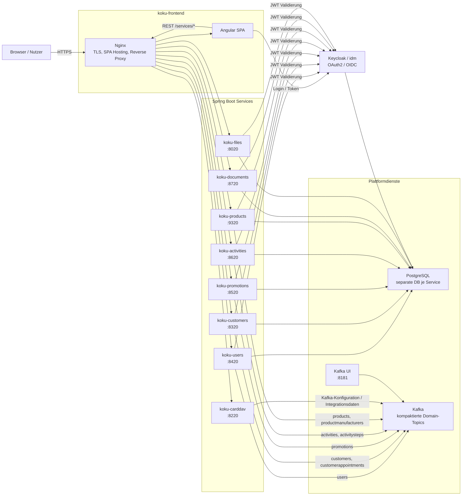

# Architekturüberblick

Koku ist eine modulare Webanwendung für ein Kosmetikstudio-Umfeld. Das System besteht aus einer Angular-Single-Page-App, mehreren fachlich geschnittenen Spring-Boot-Services, Keycloak für Identity und Access Management, PostgreSQL für persistente Daten und Kafka für asynchrone Domain-Events.

Die Anwendung folgt einem DTO-getriebenen Ansatz: Backends liefern nicht nur fachliche Daten, sondern auch deklarative UI-Beschreibungen für Formulare, Listen, Kalender, Charts und Dashboards. Das Frontend rendert diese Beschreibungen über zentrale Registries und Komponenten.

## Zielbild

- Fachliche Domänen sind in eigene Services mit eigener Datenbank getrennt.
- Synchrone Benutzerinteraktion läuft über REST hinter einem Nginx-Reverse-Proxy.
- Asynchrone Kommunikation läuft über kompaktierte Kafka-Topics.
- Authentifizierung erfolgt zentral über Keycloak, Services validieren JWTs als Resource Server.
- Gemeinsame Maven-Module stabilisieren DTOs, UI-Verträge und wiederverwendbare Bausteine.
- Deployment ist containerisiert und lokal über `docker-compose.yml` ausführbar.

## Systemübersicht

## Architekturstil

Koku kombiniert mehrere Muster:

- Modularer Monorepo-Aufbau mit Maven-Aggregator.
- Service-orientierte fachliche Laufzeitmodule.
- Shared-Kernel-DTOs für UI- und API-Verträge.
- Backend-for-Frontend-nahe DTO-Deklarationen für dynamische UI.
- Event-getriebene Veröffentlichung fachlicher Änderungen.
- Containerisierte Infrastruktur für lokale Entwicklung und Deployment.

## Zentrale Module

| Modul | Art | Aufgabe |
| --- | --- | --- |
| `koku-frontend` | Frontend | Angular-SPA, Nginx-Hosting, Reverse Proxy |
| `koku-user` | Service | Nutzer, Regionen, Willkommensdaten, private Termine |
| `koku-customer` | Service | Kunden, Kundentermine, Umsatz- und Termin-Dashboards |
| `koku-product` | Service | Produkte, Hersteller, Preisentwicklung |
| `koku-promotion` | Service | Aktionen und Promotions |
| `koku-activity` | Service | Aktivitäten, Aktivitätsschritte, Preisverläufe |
| `koku-document` | Service | Dokumente und Dokumentvorlagen |
| `koku-file` | Service | Datei-Upload, Dateiabruf und Dateiverwaltung |
| `koku-carddav` | Integrationsservice | CardDAV-kompatible Schnittstellen |
| `koku-dto` | Bibliothek | Gemeinsame Koku-DTOs |
| `formular`, `list`, `calendar`, `chart`, `dashboard` | Bibliotheken | Deklarative UI-Verträge und Factories |
| `business-logic`, `business-exception` | Bibliotheken | Business Rules und fachliche Fehlerdialoge |

