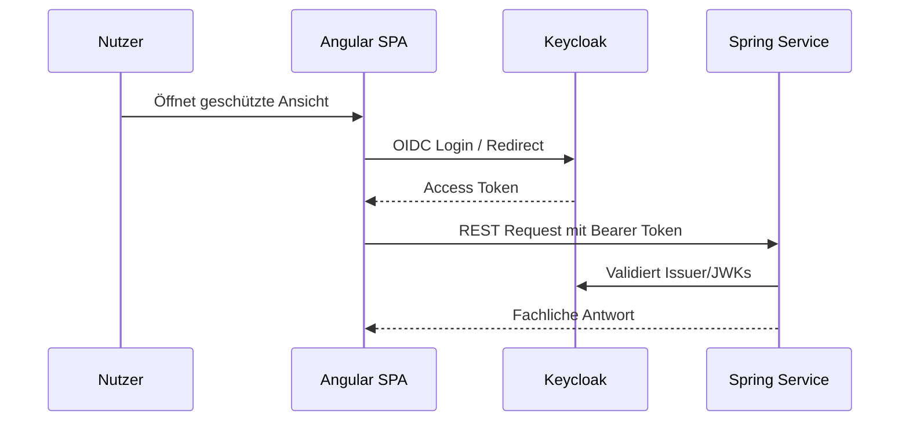

# Security und Identity

Koku verwendet Keycloak als Identity Provider. Das Frontend führt den Login über OIDC aus, die Spring-Boot-Services validieren JWTs als OAuth2 Resource Server.

## Authentifizierungsfluss

## Laufzeitkonfiguration

| Komponente | Security-Rolle |
| --- | --- |
| `koku-frontend` | Lädt `authconfig.json`, startet Login und sendet Bearer Tokens |
| `idm` | Keycloak, verwaltet Realm, Clients, Nutzer und Tokens |
| Spring-Services | Validieren JWTs über `SPRING_SECURITY_OAUTH2_RESOURCESERVER_JWT_ISSUER_URI` |
| Nginx | Terminiert TLS für Frontend/API-Zugriff im Container-Setup |

## Zertifikate und Trust

Das Compose-Setup bindet Zertifikate über Volumes ein. Spring-Services erhalten CA-Bindings über `SERVICE_BINDING_ROOT=/bindings`. Nginx verwendet Zertifikate für HTTPS. Keycloak wird ebenfalls mit Zertifikat und Key gestartet.

## Enterprise-Hinweise

- Private Keys und lokale Zertifikate dürfen nicht in Git versioniert werden.
- Secrets wie Datenbankpasswörter, Keycloak-Admin-Zugangsdaten und CardDAV-Credentials müssen außerhalb des Repositories verwaltet werden.
- Rollen- und Berechtigungskonzepte sollten explizit dokumentiert werden, sobald sie fachlich relevant werden.
- APIs sollten neben Authentifizierung auch Autorisierung je Ressource prüfen.
- Security-relevante Header, CORS und TLS-Profile sollten für Produktionsdeployments explizit festgelegt werden.
- Für Auditing sollten kritische fachliche Aktionen nachvollziehbar protokolliert werden.

