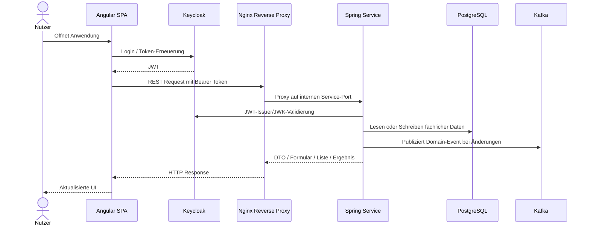

# Systemkontext und Kommunikation

Dieses Dokument beschreibt, wie Nutzer, Frontend, Backends und Plattformdienste miteinander kommunizieren.

## Externe Akteure

| Akteur | Beschreibung |
| --- | --- |
| Nutzer | Verwendet die Angular-Anwendung im Browser |
| Keycloak | Stellt Login, OIDC-Konfiguration, JWTs und JWKs bereit |
| CardDAV-/CalDAV-Clients | Können über `koku-dav` Adressbuch-, Kalender- und Principal-Endpunkte verwenden |
| Betreiber / Entwickler | Nutzen Logs, Healthchecks und Kafka UI für Betrieb und Analyse |

## Request-Flow

## Reverse-Proxy-Routen

Das Frontend spricht Backend-APIs über `/services/...` an. Nginx routet diese Pfade Docker-intern auf die Services.

| Frontend-Pfad | Backend-Service | Port |
| --- | --- | --- |
| `/services/users/*` | `koku-users` | `8420` |
| `/services/customers/*` | `koku-customers` | `8320` |
| `/services/promotions/*` | `koku-promotions` | `8520` |
| `/services/activities/*` | `koku-activities` | `8620` |
| `/services/products/*` | `koku-products` | `9320` |
| `/services/documents/*` | `koku-documents` | `8720` |
| `/services/files/*` | `koku-files` | `8020` |
| `/services/carddav/*` | `koku-dav` | `8220` |
| `/services/caldav/*` | `koku-dav` | `8220` |

Nginx stellt zusätzlich die DAV-Auto-Discovery-Pfade `/.well-known/carddav` und `/.well-known/caldav` bereit und leitet sie auf die jeweiligen `/services/...`-Präfixe weiter.

## Kommunikationsarten

| Art | Technologie | Einsatz |
| --- | --- | --- |
| Synchron | REST über HTTPS/Nginx | UI lädt und ändert fachliche Ressourcen |
| Asynchron | Kafka | Services veröffentlichen Domain-Änderungen |
| Authentifizierung | OIDC / OAuth2 | Frontend-Login und JWT-Validierung |
| Persistenz | JDBC/JPA/Flyway | Service-eigene PostgreSQL-Datenbanken |
| UI-Verträge | DTOs | Backend beschreibt UI-Struktur, Frontend rendert |

## Kopplung und Verträge

Die stärkste technische Kopplung liegt in den gemeinsamen DTO-Modulen. Diese Kopplung ist bewusst: Die UI wird deklarativ über DTOs beschrieben, und Frontend sowie Backend teilen dadurch stabile Typen für Formulare, Listen, Charts, Kalender und Dashboards.

Runtime-Kopplung zwischen fachlichen Services wird reduziert, indem fachliche Änderungen über Kafka veröffentlicht werden. Direkte REST-Service-zu-Service-Aufrufe sind in der dokumentierten Laufzeitstruktur nicht der primäre Kommunikationsweg.

