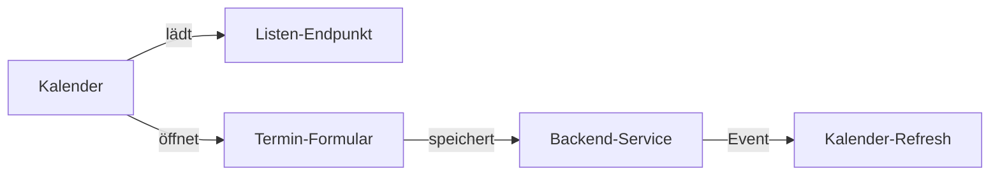

# Kalender

Kalender zeigen terminbezogene Daten aus mehreren Quellen in einer gemeinsamen Zeitansicht. Die Datenquellen und das Mapping der Terminwerte werden deklarativ beschrieben.

## Rolle im System

Kalender bündeln private Termine und Kundentermine. Sie erscheinen als eigene Ansichten oder als Dashboard-Panels. Die UI basiert auf FullCalendar, während die fachlichen Datenquellen über DTOs beschrieben werden.

## Datenquellen

Kalenderquellen beschreiben, wo Terminlisten geladen werden und welche Felder Datum, Zeit, Titel oder Löschstatus enthalten.

```java
DashboardAppointmentsPanelListSourceDto.builder()
        .title("Kundentermine")
        .listUrl("services/customers/customers/appointments")
        .startDateFieldSelectionPath("startDate")
        .startTimeFieldSelectionPath("startTime")
        .displayTextFieldSelectionPath("customerFullName")
        .build()
```

Mehrere Quellen können zu einer Kalenderansicht kombiniert werden.

## Backend-Aufbau

Kalender-Deklarationen können direkt oder über Dashboard-Panels entstehen. Das Backend legt fest, welche Quellen ein Kalender verwendet und welche Labels oder URLs relevant sind.

```java
final List<DashboardAppointmentsPanelListSourceDto> sources = List.of(
        DashboardAppointmentsPanelListSourceDto.builder()
                .title("Private Termine")
                .listUrl("services/users/users/appointments")
                .startDateFieldSelectionPath("startDate")
                .startTimeFieldSelectionPath("startTime")
                .displayTextFieldSelectionPath("description")
                .build());

dashboardFactory.addPanel(DashboardAppointmentsPanelDto.builder()
        .headline("Termine")
        .listSources(sources)
        .build());
```

## Frontend-Rendering

Das Frontend nutzt `CALENDAR_CONTENT_SETUP` aus `koku-frontend/src/app/calendar-binding/registry.ts` und Calendar-Plugins aus `app.component.ts`.

Wichtige Aufgaben:

- Quellen laden.
- Items in FullCalendar Events transformieren.
- Header, Listen und Inline-Formulare einbinden.
- Click-Actions ausführen.
- globale Refresh-Events verarbeiten.

## Interaktion

Kalender können auf verschiedene Interaktionen reagieren:

- Klick auf Termin.
- Auswahl eines Datumsbereichs.
- Öffnen von Inline-Formularen.
- Öffnen gerouteter Inhalte.
- Aktualisierung nach globalen Events.

Damit können Termine direkt aus dem Kalender bearbeitet oder neu angelegt werden.

## Zusammenspiel mit Listen und Formularen

Kalenderquellen sind oft Listen-Endpunkte. Die Detailbearbeitung erfolgt wiederum über Formulare. Dadurch entsteht ein deklarativer Flow:



## Erweiterung

Neue Kalenderbestandteile folgen diesem Muster:

1. DTO für Quelle, Container, Header oder Action ergänzen.
2. TypeScript-Typen generieren.
3. Angular-Komponente oder Calendar-Plugin ergänzen.
4. In `CALENDAR_CONTENT_SETUP` registrieren.
5. In Dashboard, Route oder Controller verwenden.

## Pflegehinweise

- Source-Mapping für Datum und Zeit muss eindeutig sein.
- Zeitzonen- und Datumsformatierung sollten konsistent behandelt werden.
- Gelöschte Termine sollten über ein klar dokumentiertes Feld markiert werden.
- Refresh-Events nach Änderungen sind wichtig, damit Kalender und Listen synchron bleiben.

