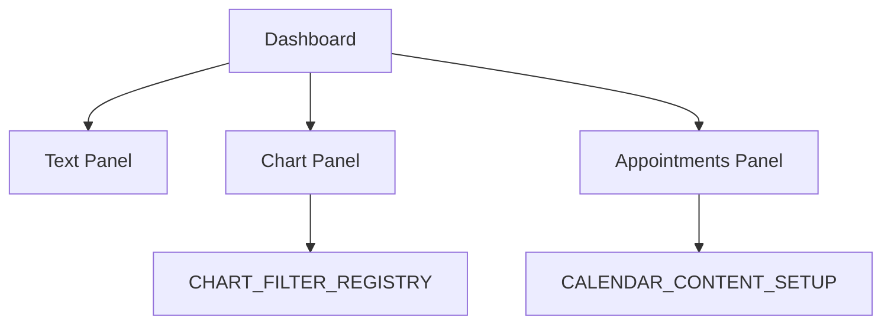

# Dashboards

Dashboards bündeln mehrere Panels zu einer kompakten fachlichen Übersicht. Sie können Text-Kennzahlen, Fortschrittsinformationen, Kalenderpanels und Charts enthalten.

## Rolle im System

Dashboards dienen als Einstieg in operative oder analytische Sichten. Beispiele sind Willkommensansichten, Terminübersichten und Umsatzübersichten.

## Backend-Aufbau

Dashboards werden mit `DashboardViewFactory` beschrieben. Die Factory erzeugt Container und Panels.

```java
final DashboardViewFactory dashboardFactory = new DashboardViewFactory(
        new DefaultDashboardViewContentIdGenerator(),
        DashboardGridContainerDto.builder().cols(1).build());

dashboardFactory.addPanel(DashboardTextPanelDto.builder()
        .headline("Willkommen")
        .text("Schön, dass du da bist.")
        .build());

dashboardFactory.addPanel(DashboardAsyncChartPanelDto.builder()
        .headline("Umsatzentwicklung")
        .sourceUrl("services/customers/customers/appointments/dashboard/revenues/chart")
        .build());

return dashboardFactory.create();
```

## Frontend-Rendering

Das Frontend nutzt `DASHBOARD_CONTENT_REGISTRY` aus `koku-frontend/src/app/dashboard-binding/registry.ts`. Dashboard-Panels können wiederum andere Registries verwenden, etwa `CHART_FILTER_REGISTRY` für Chart-Filter.

## Panel-Typen

Typische Panels:

- Textpanels mit Kennzahlen und Erklärungen.
- Async-Textpanels mit `sourceUrl`.
- Async-Chartpanels.
- Kalender-/Terminpanels.
- Grid-Container für responsive Anordnung.

## Async Panels

Async Panels beschreiben eine Datenquelle, die das Frontend nachlädt. Dadurch kann das Dashboard initial als Struktur geladen werden, während einzelne Kennzahlen oder Charts separat aktualisiert werden.

## Zusammenspiel mit anderen Komponenten

Dashboards sind Kompositionskomponenten. Sie binden andere UI-Typen ein:



## Erweiterung

Neue Dashboard-Panels folgen diesem Muster:

1. Dashboard-Panel-DTO ergänzen.
2. TypeScript-Typen generieren.
3. Angular-Panel-Komponente bauen.
4. In `DASHBOARD_CONTENT_REGISTRY` registrieren.
5. Backend-Factory verwendet das neue Panel.

## Pflegehinweise

- Dashboards sollten nicht fachliche Berechnung ins Frontend verschieben.
- Async Panels brauchen robuste Loading- und Error-Zustände.
- Panel-Grids sollten responsive und wiederholbar bleiben.
- Wiederverwendbare Kennzahlen sollten als eigene Endpunkte beschrieben werden.

