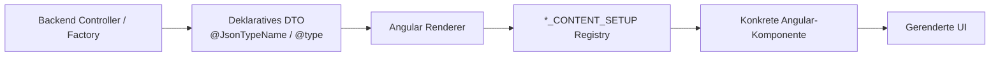

# Deklarative UI-Konzepte

Koku folgt bei den wichtigsten UI-Typen einem deklarativen Ansatz: Das Backend beschreibt nicht HTML oder Angular-Komponenten direkt, sondern liefert DTOs aus. Diese DTOs definieren Felder, Container, Aktionen, Datenquellen, Filter, Events und Darstellungshinweise. Das Frontend besitzt pro UI-Typ eine Registry, die anhand von `@type` entscheidet, welche Angular-Komponente gerendert wird.

Dadurch liegt fachliche UI-Struktur nah an der jeweiligen Domäne im Backend, während Rendering, Styling und Interaktion zentral im Frontend implementiert bleiben.

## Grundprinzip

## Gemeinsame Bausteine

| Baustein | Rolle |
| --- | --- |
| `@JsonTypeName` / `@type` | verbindet Java-DTO, JSON und TypeScript-Union |
| Factory | baut konsistente View-DTOs im Backend |
| `valuePath` / Source-Pfade | binden UI-Elemente an fachliche DTO-Felder |
| Registry | mappt DTO-Typen auf Angular-Komponenten |
| Renderer | erzeugt konkrete UI aus der Deklaration |
| Events | verbinden UI-Aktionen, Toasts, Reloads und globale Aktualisierung |

## Detailseiten

Die einzelnen UI-Typen sind separat dokumentiert:

- [Formulare](forms.md)
- [Listen](lists.md)
- [Kalender](calendars.md)
- [Charts](charts.md)
- [Dashboards](dashboards.md)
- [Business Rules](business-rules.md)

## Vorteile

- Fachliche UI-Struktur kann im Backend nahe an der Domäne beschrieben werden.
- Das Frontend bleibt generisch und wiederverwendbar.
- Neue fachliche Views benötigen oft keine neue Angular-Seite.
- Listen, Formulare, Kalender, Charts und Dashboards können ineinander eingebettet werden.
- Wiederkehrende Konzepte wie Events, Source-Mapping und Confirmations bleiben konsistent.

## Trade-offs

- DTOs und Frontend-Registries müssen synchron weiterentwickelt werden.
- Fehler in `@type`-Namen oder Source-Pfaden zeigen sich oft erst zur Laufzeit.
- Die generischen Renderer erhöhen die Komplexität des Frontends.
- Fachliche UI-Logik muss sauber zwischen Backend-Deklaration und Frontend-Verhalten getrennt werden.

